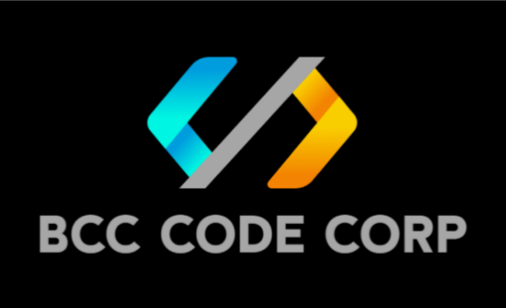

# SiGeRU (Sistema de Gestión de Residuos Urbanos)

Este repositorio contiene el desarrollo del **Sistema de Gestión de Residuos Urbanos (SiGeRU)**, una solución tecnológica integral diseñada para optimizar la recolección, monitoreo y gestión de residuos. Este proyecto es desarrollado por **BCC Code Corp.** en el marco del **Proyecto de Pasaje de Grado 2026** de la Escuela Superior de Informática (ESI) - UTU.

> **Nota:** *BCC Code Corp.* es una entidad independiente constituida para el desarrollo de soluciones de software a medida, sin relación con herramientas de infraestructura o código abierto de terceros que compartan siglas similares.

---

## 🚀 Descripción del Proyecto
SiGeRU nace con el objetivo de modernizar la gestión urbana mediante una plataforma escalable que permite:
* **Monitoreo en tiempo real:** Visualización y control del estado de los puntos de recolección.
* **Optimización Logística:** Algoritmos para la mejora de rutas y recolección eficiente.
* **Gestión de Datos:** Análisis de información para la toma de decisiones estratégicas.

## 🛠 Tecnologías Utilizadas
El proyecto cumple con los estándares técnicos requeridos por la ESI:
* **Frontend:** HTML5, CSS y JavaScript (Arquitectura MVC).
* **Backend:** PHP 8 (API REST, Arquitectura MVC).
* **Base de Datos:** MySQL 8.
* **Infraestructura:** Entorno Linux, Dockerizado y versionado en Git.

## 🏗 Metodología de Desarrollo
En **BCC Code Corp.**, aplicamos metodologías ágiles para asegurar el control de calidad:
* **Planificación:** Gestión mediante tableros Kanban/Scrum.
* **Integración Continua:** Automatización mediante GitHub Actions.

## 👤 Equipo de Desarrollo
* **Francisco Barreto** - Coordinador
* **Mateo Cortizo** - SubCoordinador
* **Giuliano Crotti** - Miembro
