# Diagrama de clases de SiGeRU

Revisión del 12/09/2026, obtenida de las declaraciones PHP del proyecto. Representa las clases implementadas, no las entidades del MER. Los métodos se muestran por nombre; los parámetros y tipos completos se consultan en el código. Las flechas indican uso de otra clase, no herencia ni cardinalidades de tablas.

Los roles del MER (Funcionario, Vecino, Chofer, Recolector, Operario y Administrador) se persisten mediante tablas y `Usuario`; no existen como subclases PHP. `Operacion` concentra la persistencia de rutas, cuadrillas, maquinaria, residuos y sus relaciones. No se dibuja una jerarquía de clases que el programa no implementa.

El frontend usa funciones JavaScript y consume endpoints; por eso no aparece como una clase PHP. Los endpoints aplican sesión, validación y respuesta mediante `Sesion`, `Validacion` y `Respuesta`. La conexión PDO se inyecta en modelos y controladores.

## Vista resumida

La imagen muestra las operaciones principales por capa. La siguiente fuente Mermaid incluye todos los métodos públicos; es editable en `diagrama-clases.mmd`.

## Diagrama completo

```mermaid
classDiagram
direction LR
class AuthController {
  <<controller>>
  -Usuario usuarioModel
  +login()
  +registro()
}
class CamionController {
  <<controller>>
  -Camion camionModel
  -PDO pdo
  -Usuario usuarioModel
  -Incidencia incidenciaModel
  +listar()
  +obtener()
  +crear()
  +actualizar()
  +eliminar()
  +asignarCuadrilla()
  +desasignarCuadrilla()
}
class CentroAcopioController {
  <<controller>>
  -CentroAcopio centroModel
  +listar()
  +obtener()
  +crear()
  +actualizar()
  +eliminar()
}
class ContenedorController {
  <<controller>>
  -Contenedor contenedorModel
  -PDO pdo
  +listar()
  +obtener()
  +crear()
  +actualizar()
  +eliminar()
}
class IncidenciaController {
  <<controller>>
  -Incidencia incidenciaModel
  -Camion camionModel
  -Notificacion notificacionModel
  -PDO pdo
  +crear()
  +listar()
  +listarPorUsuario()
  +asignar()
  +resolver()
}
class NotificacionController {
  <<controller>>
  -Notificacion notificacionModel
  +listar()
  +listarAnuncios()
  +crearAnuncio()
  +marcarLeida()
}
class OperacionController {
  <<controller>>
  -Operacion m
  +atender()
}
class UsuarioController {
  <<controller>>
  -Usuario usuarioModel
  +listar()
  +obtener()
  +crear()
  +actualizar()
  +eliminar()
}
class Camion {
  <<model>>
  -PDO pdo
  +listarTodos()
  +buscarPorMatricula()
  +buscarPorCuadrilla()
  +crear()
  +actualizar()
  +actualizarEstado()
  +eliminar()
  +asignarCuadrilla()
  +desasignarCuadrilla()
  +buscarCuadrillaDisponible()
}
class CentroAcopio {
  <<model>>
  -PDO pdo
  +listarTodos()
  +buscarPorId()
  +crear()
  +actualizar()
  +guardarCapacidad()
  +ultimoId()
  +eliminar()
}
class Contenedor {
  <<model>>
  -PDO pdo
  +listarTodos()
  +buscarPorId()
  +crear()
  +actualizar()
  +eliminar()
  +asignadoEnCurso()
  +enServicio()
}
class Incidencia {
  <<model>>
  -PDO pdo
  +crear()
  +listarTodas()
  +listarPorUsuario()
  +buscarPorId()
  +asignar()
  +resolver()
  +tieneIncidenciasEnCurso()
  +describir()
  +asociarContenedor()
  +listarPorCuadrilla()
  +cerrarReclamos()
  +registrarHistorial()
}
class Notificacion {
  <<model>>
  -PDO pdo
  +crear()
  +listarParaUsuario()
  +listarAnuncios()
  +buscarPorId()
  +marcarLeida()
}
class Operacion {
  <<model>>
  -PDO pdo
  +consultar()
  +ejecutar()
  +insertar()
  +actualizar()
  +exigir()
  +reportes()
  +registroActivo()
  +maquinariaDelCentro()
  +recolectorDeCuadrilla()
  +asignacionDelContenedor()
  +residuoHabilitado()
  +vecinoExistente()
  +incidenciaPropiaAbierta()
  +camionExistente()
  +incidenciaConContenedor()
  +registroEditable()
  +centroDisponible()
  +rutaDisponible()
  +cuadrillaDisponible()
  +camionDisponibleDeCuadrilla()
  +contenedoresDeRuta()
  +incidenciaAbiertaDelContenedor()
  +vincularCuadrillaRuta()
  +vincularCamionRuta()
  +planificarIncidencias()
  +usuarioActivo()
  +cuadrillaExistente()
  +choferActivo()
  +camionActivo()
  +asignarChofer()
  +operarioActivo()
  +contenedorEnServicio()
  +rutaActiva()
  +vincularContenedorRuta()
  +habilitarResiduo()
  +listar()
}
class Usuario {
  <<model>>
  -PDO pdo
  +buscarPorEmail()
  +buscarPerfilPorEmail()
  +buscarPorId()
  +listarTodos()
  +existeEmailOCedula()
  +crear()
  +actualizar()
  +actualizarPassword()
  +eliminar()
  +estadoRegistro()
  +ultimoId()
  +verificarIntentos()
  +registrarIntento()
  +validarCambioRol()
  +sincronizarPerfil()
  +validarCedulaUruguaya()
}
class Respuesta {
  <<service>>
  +enviar()
  +enviarResultado()
  +enviarErrorInterno()
}
class Sesion {
  <<service>>
  +iniciar()
  +usuario()
  +exigir()
  +rechazar()
  +datos()
  +proteger()
}
class Validacion {
  <<service>>
  +password()
  +entrada()
}
AuthController --> Usuario : utiliza
CamionController --> Camion : utiliza
CamionController --> Usuario : utiliza
CamionController --> Incidencia : utiliza
CentroAcopioController --> CentroAcopio : utiliza
ContenedorController --> Contenedor : utiliza
IncidenciaController --> Incidencia : utiliza
IncidenciaController --> Camion : utiliza
IncidenciaController --> Notificacion : utiliza
IncidenciaController --> Contenedor : utiliza
NotificacionController --> Notificacion : utiliza
OperacionController --> Operacion : utiliza
UsuarioController --> Usuario : utiliza
Camion --> PDO : persistencia
CentroAcopio --> PDO : persistencia
Contenedor --> PDO : persistencia
Incidencia --> PDO : persistencia
Notificacion --> PDO : persistencia
Operacion --> PDO : persistencia
Usuario --> PDO : persistencia
class PDO {
 <<external>>
 +prepare()
 +beginTransaction()
 +commit()
 +rollBack()
}
```

## Índice de código

| Clase | Capa | Archivo |
|---|---|---|
| AuthController | Controladores | [Backend/controllers/AuthController.php](../Backend/controllers/AuthController.php) |
| CamionController | Controladores | [Backend/controllers/CamionController.php](../Backend/controllers/CamionController.php) |
| CentroAcopioController | Controladores | [Backend/controllers/CentroAcopioController.php](../Backend/controllers/CentroAcopioController.php) |
| ContenedorController | Controladores | [Backend/controllers/ContenedorController.php](../Backend/controllers/ContenedorController.php) |
| IncidenciaController | Controladores | [Backend/controllers/IncidenciaController.php](../Backend/controllers/IncidenciaController.php) |
| NotificacionController | Controladores | [Backend/controllers/NotificacionController.php](../Backend/controllers/NotificacionController.php) |
| OperacionController | Controladores | [Backend/controllers/OperacionController.php](../Backend/controllers/OperacionController.php) |
| UsuarioController | Controladores | [Backend/controllers/UsuarioController.php](../Backend/controllers/UsuarioController.php) |
| Camion | Modelos | [Backend/models/Camion.php](../Backend/models/Camion.php) |
| CentroAcopio | Modelos | [Backend/models/CentroAcopio.php](../Backend/models/CentroAcopio.php) |
| Contenedor | Modelos | [Backend/models/Contenedor.php](../Backend/models/Contenedor.php) |
| Incidencia | Modelos | [Backend/models/Incidencia.php](../Backend/models/Incidencia.php) |
| Notificacion | Modelos | [Backend/models/Notificacion.php](../Backend/models/Notificacion.php) |
| Operacion | Modelos | [Backend/models/Operacion.php](../Backend/models/Operacion.php) |
| Usuario | Modelos | [Backend/models/Usuario.php](../Backend/models/Usuario.php) |
| Respuesta | Servicios comunes | [Backend/core/Respuesta.php](../Backend/core/Respuesta.php) |
| Sesion | Servicios comunes | [Backend/core/Sesion.php](../Backend/core/Sesion.php) |
| Validacion | Servicios comunes | [Backend/core/Validacion.php](../Backend/core/Validacion.php) |

## Flujo de una operación

`panel.html` / `operaciones.js` → endpoint de la API → sesión y validación → controlador → modelo → PDO. La respuesta confirma la transacción y registra la auditoría cuando corresponde; las operaciones fallidas se revierten. Las tablas de historial forman parte de la persistencia y no son clases adicionales.
